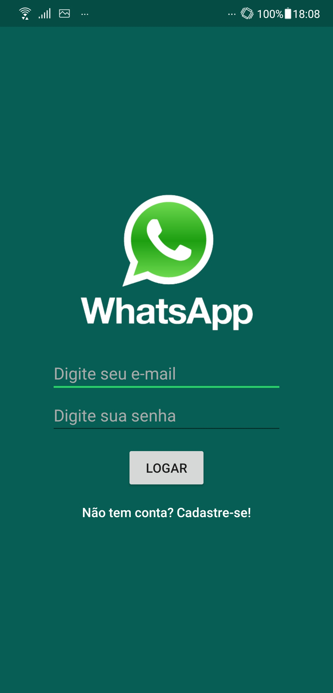
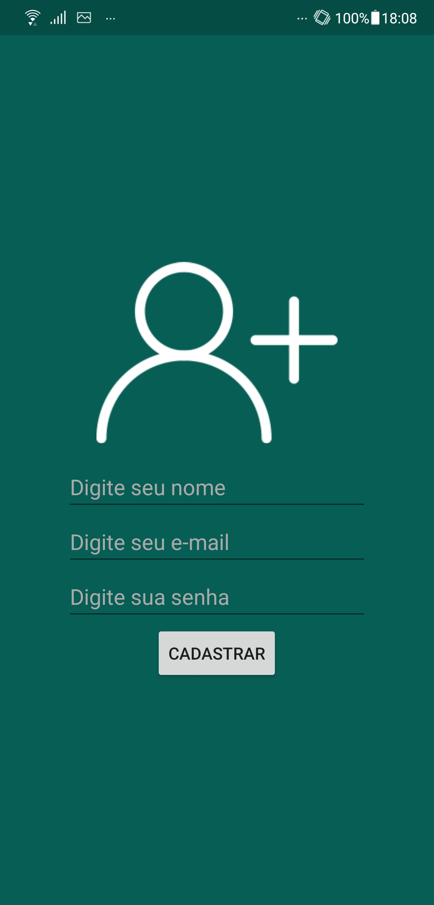
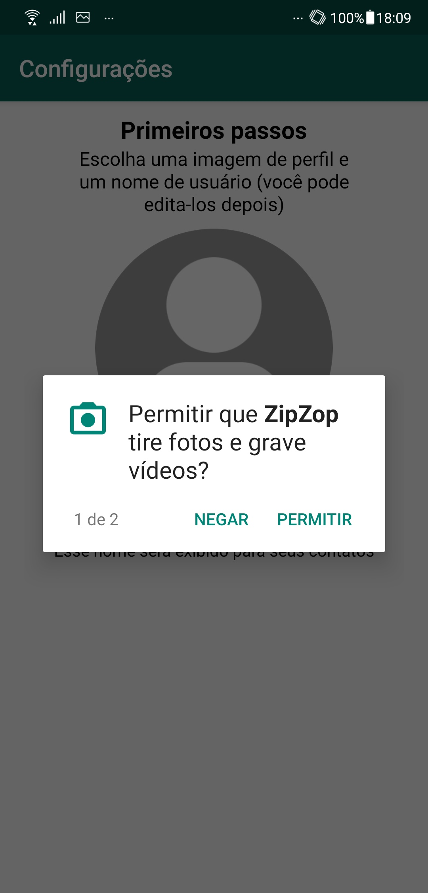
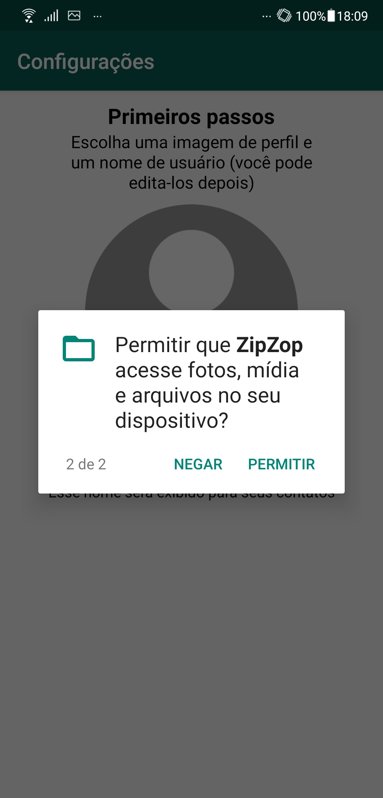
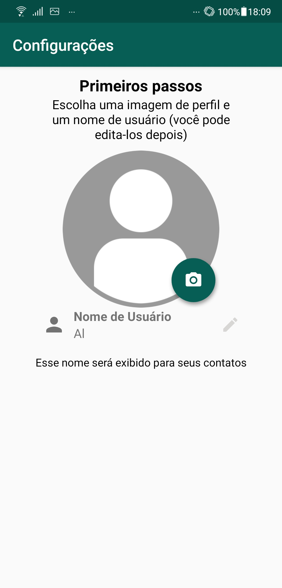
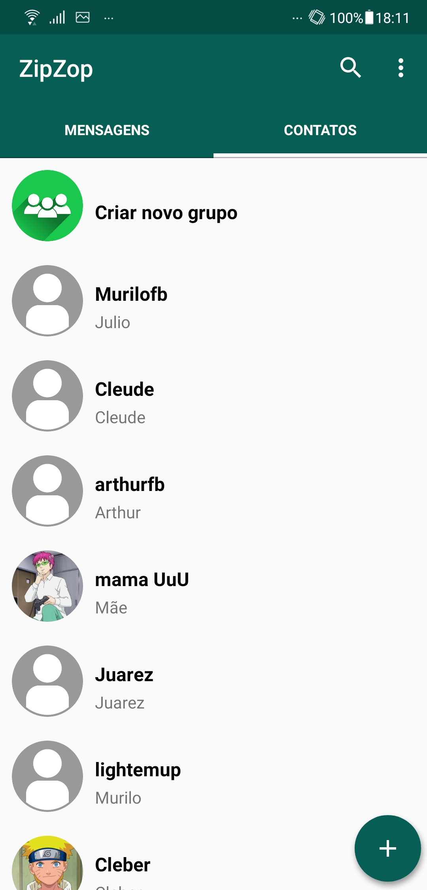
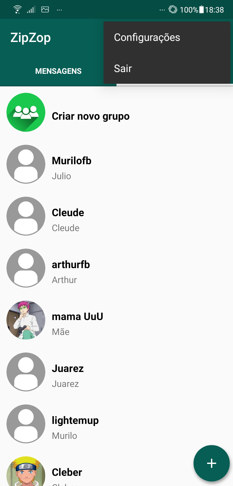

    <h1> WhatsApp Clone </h1>

 

   

 
 

|                                                                                |                                                                      |                                                                         |                                                                                       |
|:------------------------------------------------------------------------------:|:--------------------------------------------------------------------:|:-----------------------------------------------------------------------:|:-------------------------------------------------------------------------------------:|
|               |  |  |                |
|  |        |     |  |

 

 <a href="#theproject">The Project</a> •
 <a href="#target">Target</a> •
 <a href="#technologies">Technologies</a> •
 <a href="#howtotest">How to test</a> •

 
 

<h2> 📓 The Project </h2>

 The WhatsApp clone was built in order to improve native Android app development skills, correlated with learning non-relational databases, in this case, Firebase.

<h2> 💡 Target </h2>
Clone of WhatsApp application, performing the basic functions of the application, in which was implemented Java language, using Firebase as a database.

 

<h2> 🛠 Technologies </h2>
The following tools were used in building the project:  

|                     Type                     |         Tools          |                           References                           |
|:--------------------------------------------:|:----------------------:|:--------------------------------------------------------------:|
|          Programming Language (App)          |          JAVA          |            https://docs.oracle.com/javase/tutorial/            | 
|                     IDE                      |     ANDROID STUDIO     |              https://developer.android.com/studio              |
|                   Database                   |        FIREBASE        |                  https://firebase.google.com/                  |
|         Graphic components (Google)          | GOOGLE MATERIAL DESIGN |                      https://material.io/                      |
|               CardView Layout                |       CARD VIEW        | https://developer.android.com/guide/topics/ui/layout/cardview  |
|               Custom ViewPage                |    SMART TAB LAYOUT    |         https://github.com/ogaclejapan/SmartTabLayout          |
|         Floating Action Button (FAB)         |          FAB           |         https://github.com/Clans/FloatingActionButton          |
|              Circular ImageView              |   CIRCLE IMAGE VIEW    |          https://github.com/hdodenhof/CircleImageView          |
| Media Management and Image Loading Framework |         GLIDE          |               https://github.com/bumptech/glide                |
|            Image Cropping Library            |     IMAGE CROPPER      |       https://github.com/ArthurHub/Android-Image-Cropper       |
|         Material SearchView Library          |  MATERIAL SEARCH VIEW  |      https://github.com/MiguelCatalan/MaterialSearchView       |
 
 

  
  
  
  
  
   

<h2> 🧪 How to test </h2>
After installed Android Studio, it is necessary to set database, on this case Firebase, following the steps:
<ul>
      <li>Create a Firebase account, if you don't have one</li>
      <li>Create a project on Firebase and link with Android Studio, by SHA-1 key (gradle/app//tasks/android/signingReport) and the base package of the project (AndroidManifests.xml)</li>
      <li>Set the Firebase Authentication, enabling only email</li>
      <li>Set the Firebase RealtimeDatabase, with the rule that any person can modify the database</li>
      <li>Set the Firebase Storage</li>
      <li>Download and put google-services.json file into the folder indicated by Firebase</li>
      <li>Compile the project and run it via emulator or physically via smartphone ou tablet with Android system higher than 4.1 (Jelly Bean)</li>
      <li>Obs: Tested with MIUI Global 12.0.3</li>
</ul>

